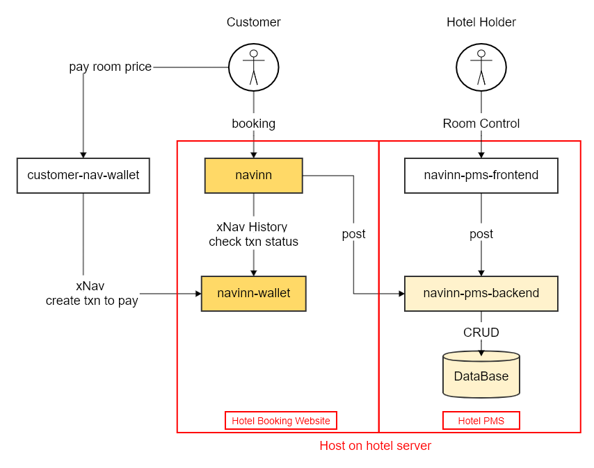
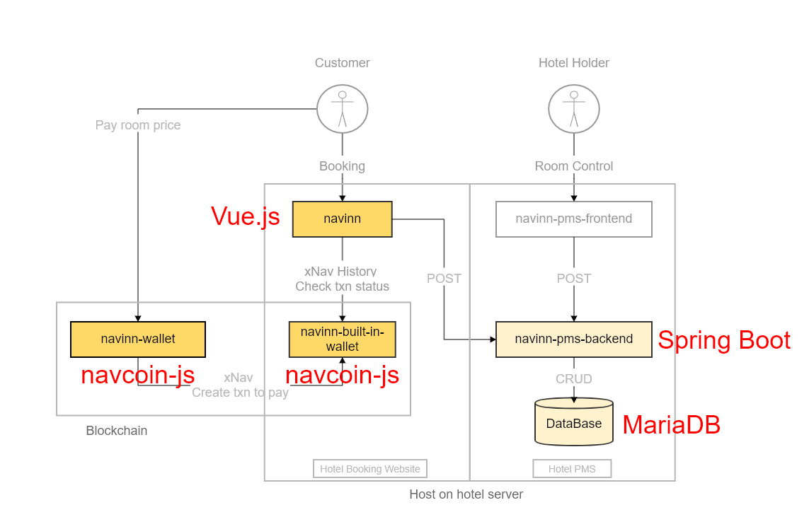

# navinn
This project is for navcoin hackathon 2021, and developing with [navcoin-js](https://github.com/aguycalled/navcoin-js)

Navinn is a website for online booking, which is safe, anonymous and untraceable.

## Demo
    Navinn: http://139.162.98.187:8080/
    Navinn-Wallet: https://139.162.98.187:8082/
### Booking instruction
Customer should remember their [Payment Key].
It's the key for customer payment, and is your room key when you want to access in yor room.

Instruction:
* BOOK:
    1. [navinn > Booking page]: Booking it! (Book date will not avialable to pick if another booked earlier)
    2. [navinn > Booking page]: Remember your [Payment Key]
    3. [navinn > Search page]: Search with [Payment Key] for payment details
    4. [navinn > Search page]: Check all booking info is correct, the booking status would be "UNPAID"
    5. [navinn > History page]: (Optional)Press refresh button, get hotel's all booking info

* PAY:
    1. [navinn-wallet(just for test)/or your personal xNav wallet that can create txn with memo]
    2. [navinn-wallet(just for test)]: Input paymentKey xNavAmount
        [navinn-wallet > paymentKey]: [navinn > Search page > Total Amount]
        [navinn-wallet > xNavAmount]: [[navinn > Search page > Receive Wallet])
    3. [navinn > Search page]: Back to Search page or History page
            , and search again, booking status would be "PAID"

## Related project:
* [navinn-pms-backend](https://github.com/z5612365/navinn-pms-backend): Hotel Property Management System (backend)
* [navinn-pms-frontend](https://github.com/z5612365/navinn-pms-frontend): Hotel Property Management System (frontend), and it embeds a wallet([navinn-wallet](https://github.com/z5612365/navinn-wallet)) for receiving xNav
<!---
* [navinn-wallet](https://github.com/z5612365/navinn-wallet): Simple wallet for send xNav
-->

## Install
* Git clone [navinn](https://github.com/z5612365/navinn)
* Run [navinn](https://github.com/z5612365/navinn)

        npm i
        npm run serve

* Git clone [navinn-pms-backend](https://github.com/z5612365/navinn-pms-backend)
* Install MariaDB
* Create DB user and DB(navinndb)
* Change [navinn-pms-backend DB setting](https://github.com/z5612365/navinn-pms-backend/blob/master/navinn-ap/navinn-ap-customer-gl/src/main/resources/application.properties)
* Create dataBase schema and insert initial data(DDL and initial data is in [navinn-pms-backend](https://github.com/z5612365/navinn-pms-backend) db folder)
* Run [navinn-pms-backend](https://github.com/z5612365/navinn-pms-backend)

        Run Spring with Maven
        
## Goals to achieve

1. Short-term goal is for minimum viable product(MVP) demo.
1. Long-term goal is to combine hotel property management systems(PMS) to provide integrated service.

### Activity Diagram

* Short-term goal:
  * [navinn](https://github.com/z5612365/navinn): Entry point for customer booking.
  * [navinn-wallet](https://github.com/z5612365/navinn-wallet): Hardcode in [navinn](https://github.com/z5612365/navinn) currently
  * [navinn-pms-backend](https://github.com/z5612365/navinn-pms-backend): Api for fetching txn, room and booking data
  * Database(MariaDB): Store txn, room and booking data
* Long-term goal:
  * [navinn](https://github.com/z5612365/navinn): Entry point for customer booking.
  * [navinn-wallet](https://github.com/z5612365/navinn-wallet): [navinn](https://github.com/z5612365/navinn) built-in wallet and light-weight wallet for customer to pay xNav txn.
  * [navinn-pms-frontend](https://github.com/z5612365/navinn-pms-frontend): For hotel holder to manage room.
  * [navinn-pms-backend](https://github.com/z5612365/navinn-pms-backend): Api for [navinn](https://github.com/z5612365/navinn) and [navinn-pms-frontend](https://github.com/z5612365/navinn-pms-frontend) 
  * Database(MariaDB): Store txn, room and booking data

### Frameworks Usage

