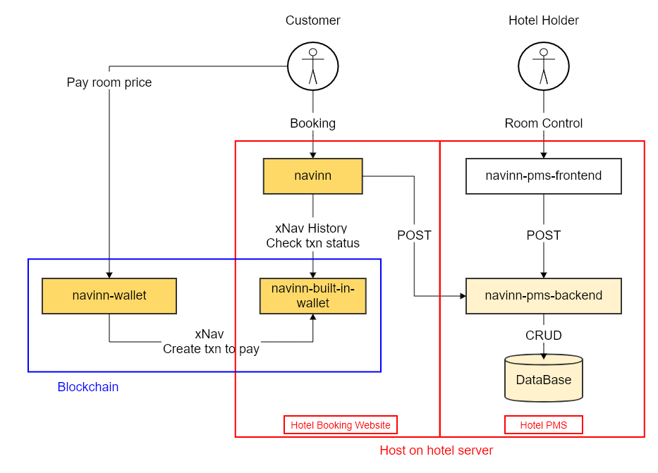

# navinn
This project is for navcoin hackathon 2021, and developing with [navcoin-js](https://github.com/aguycalled/navcoin-js)

Navinn is a website for online booking, which is safe, anonymous and untraceable.

## Related project:
* [navinn-pms-backend](https://github.com/z5612365/navinn-pms-backend): Hotel Property Management System (backend)
* [navinn-pms-frontend](https://github.com/z5612365/navinn-pms-frontend): Hotel Property Management System (frontend), and it embeds a wallet([navinn-wallet](https://github.com/z5612365/navinn-wallet)) for receiving xNav
<!---
* [navinn-wallet](https://github.com/z5612365/navinn-wallet): Simple wallet for send xNav
-->

## Install
* Git clone [navinn](https://github.com/z5612365/navinn)
* Run [navinn](https://github.com/z5612365/navinn)

        npm i
        npm run serve

* Git clone [navinn-pms-backend](https://github.com/z5612365/navinn-pms-backend)
* Install MariaDB
* Create DB user and DB(navinndb)
* Change [navinn-pms-backend DB setting](https://github.com/z5612365/navinn-pms-backend/blob/master/navinn-ap/navinn-ap-customer-gl/src/main/resources/application.properties)
* Create dataBase schema and insert initial data(DDL and initial data is in [navinn-pms-backend](https://github.com/z5612365/navinn-pms-backend) db folder)
* Run [navinn-pms-backend](https://github.com/z5612365/navinn-pms-backend)

        Run Spring with Maven
        
## Goals to achieve

1. Short-term goal is for minimum viable product(MVP) demo.
1. Long-term goal is to combine hotel property management systems(PMS) to provide integrated service.

### Activity Diagram

* Short-term goal:
  * [navinn](https://github.com/z5612365/navinn): Entry point for customer booking.
  * [navinn-wallet](https://github.com/z5612365/navinn-wallet): Hardcode in [navinn](https://github.com/z5612365/navinn) currently
  * [navinn-pms-backend](https://github.com/z5612365/navinn-pms-backend): Api for fetching txn, room and booking data
  * Database(MariaDB): Store txn, room and booking data
* Long-term goal:
  * [navinn](https://github.com/z5612365/navinn): Entry point for customer booking.
  * [navinn-wallet](https://github.com/z5612365/navinn-wallet): [navinn](https://github.com/z5612365/navinn) built-in wallet and light-weight wallet for customer to pay xNav txn.
  * [navinn-pms-frontend](https://github.com/z5612365/navinn-pms-frontend): For hotel holder to manage room.
  * [navinn-pms-backend](https://github.com/z5612365/navinn-pms-backend): Api for [navinn](https://github.com/z5612365/navinn) and [navinn-pms-frontend](https://github.com/z5612365/navinn-pms-frontend) 
  * Database(MariaDB): Store txn, room and booking data

### Frameworks Usage

## Booking instruction
1. Customer select room to book.
1. Navinn website show the key of selected room.
1. In xNav's memo feild, Customer send key value back with his own wallet to wallet of [navinn-pms-frontend](https://github.com/z5612365/navinn-pms-frontend).
1. Wallet of [navinn-pms-frontend](https://github.com/z5612365/navinn-pms-frontend) receive xNav with correct key of selected room, and comfirm this transaction.
1. Navinn website shows this booking transaction is comfirmed
1. Customer arrive hotel, and go get a room with room key.

